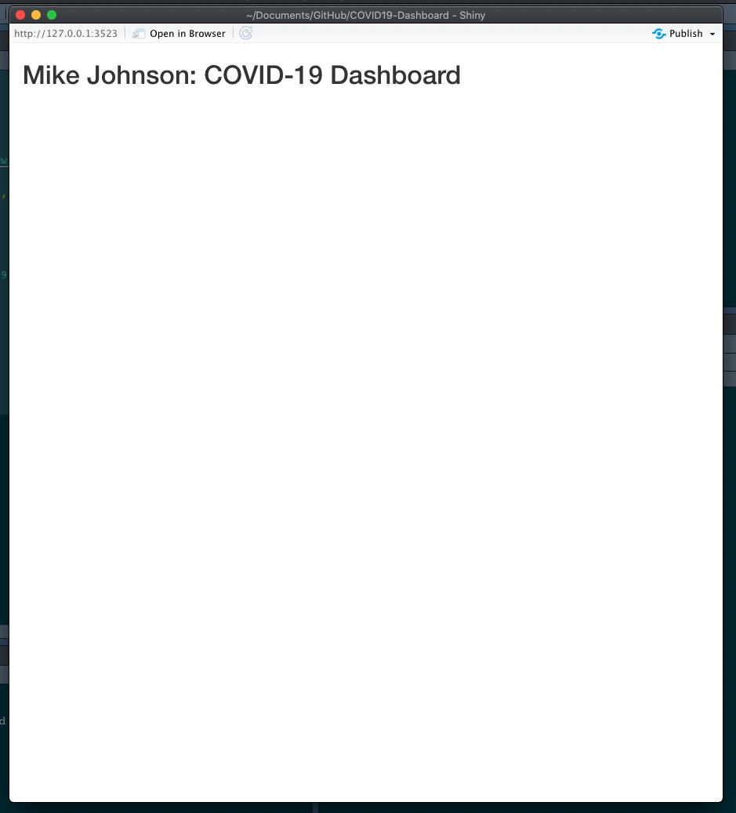
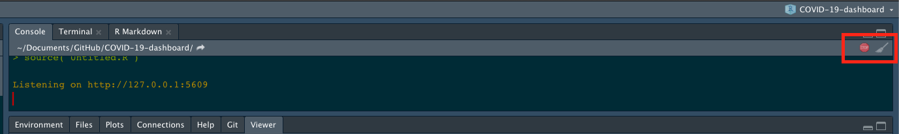

```{r klippy, echo=FALSE, include=TRUE}
klippy::klippy(position = c('top', 'right'))
```

```{r setup, include=FALSE}
knitr::opts_chunk$set(echo = TRUE, 
                      class.source = "numberLines lineAnchors",
                      warning = FALSE, message = FALSE,
                      eval = FALSE)
```

In the last [section](04_tables.html) we built functions that would generate tables (make_table) and charts (make_graph) or modify a map (zoom_to_county) based on a user-provided FIP code. Shiny is a system that lets you build interactive web applications that react to selections and action made in a user interface (UI), based on code that runs in a 'server'.

Thus, Shiny applications have two components, 

1. a UI that dictates how things look and stores what a user does (click, add text, move sliders, etc.)
2. a server function, that runs code and builds visualizations to be shown in the UI.

When something changes in the UI (e.g. a user clicks on something) the server function is triggered or 'reacts'.

For this class project we are going to start with arguably the most a basic user interface - a `fluidPage`. A `fluidPage` layout consists of rows and include columns. Rows help ensure that elements appear on the same line (if the browser has adequate width). Columns exist for the purpose of defining how much horizontal space within a 12-unit wide grid elements should occupy. `fluidPage` layouts scale their components in real-time to fill all available browser width.

So with that basic background, start by opening your `app.R` file in your COVID-19-dashboard project. In the top of this file, lets put what we have already developed by sourcing our `helpers.R` file and reading in our time series data, building today's county centroids, and initializing a basemap.

```{r, eval = FALSE}
# Source helper functions -----
source("helpers.R")

# Initalize data
covid19  <-  read_covid19('https://raw.githubusercontent.com/nytimes/covid-19-data/master/us-counties.csv')
today    <-  today_centroids(counties, covid19)
basemap  <-  basemap(today)
```

Next, lets initialize the UI element as a `fluidPage`. In our UI, lets add a `titlePanel` describing what the application is (You should obviously change the title `r emo::ji('smile')`)

```{r, eval = FALSE}

# User interface ----
ui <- fluidPage( 
  titlePanel('Mike Johnson: COVID-19 Dashboard')
  )
```

For a Shiny App to run, we need a server function. For now, lets create a server function that does nothing.

```{r, eval = FALSE}
# Server logic ----
server <- function(input, output) {
  
}
```

Last, you need to tell Shiny how to which UI relates to what server function in a synchronized Shiny object. To do this we provide our `ui` and `server` to the `shinyApp` function:

```{r, eval = FALSE}
shinyApp(ui, server)
```

Once finished, you should have an `app.R` file that looks like this:

```{r, eval=F}
# Source helper functions -----
source("helpers.R")

# Initalize data
covid19  <-  read_covid19('https://raw.githubusercontent.com/nytimes/covid-19-data/master/us-counties.csv')
today    <-  today_centroids(counties, covid19)
basemap  <-  basemap(today)

# User interface ----
ui <- fluidPage( 
  titlePanel('Mike Johnson: COVID-19 Dashboard')
  )

# Server logic ----
server <- function(input, output) { }

shinyApp( ui, server )
```

Once there, you can highlight your entire file (CMND/CNTL + A) and hit Run. The result should be something that looks like this:

```{r, out.width = "400px", eval=TRUE,echo=FALSE}

```

Sometimes Shiny will hang up your R session. If this happens go ahead and kill the Shiny Process by clicking on the red stop sign in the Console window (see below).

```{r, out.width = "800px", eval=TRUE,echo=FALSE}

```

## Conclusion

With that, you are ready to start adding elements to your Shiny App!! In the next [section](06_shiny_maps.html) we'll see add our `leaflet` map to Shiny App skeloton.