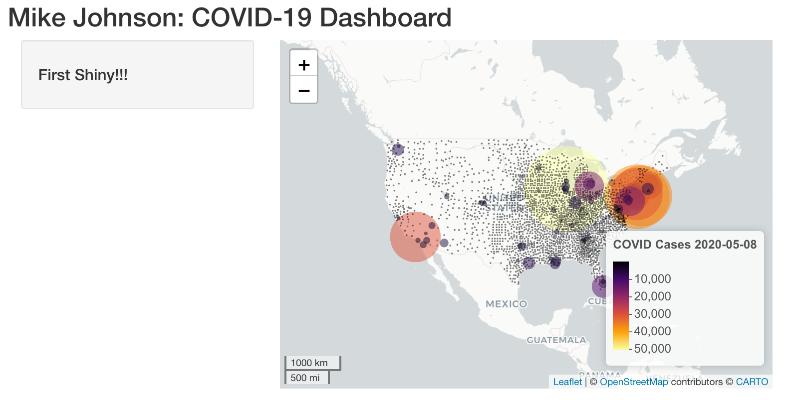
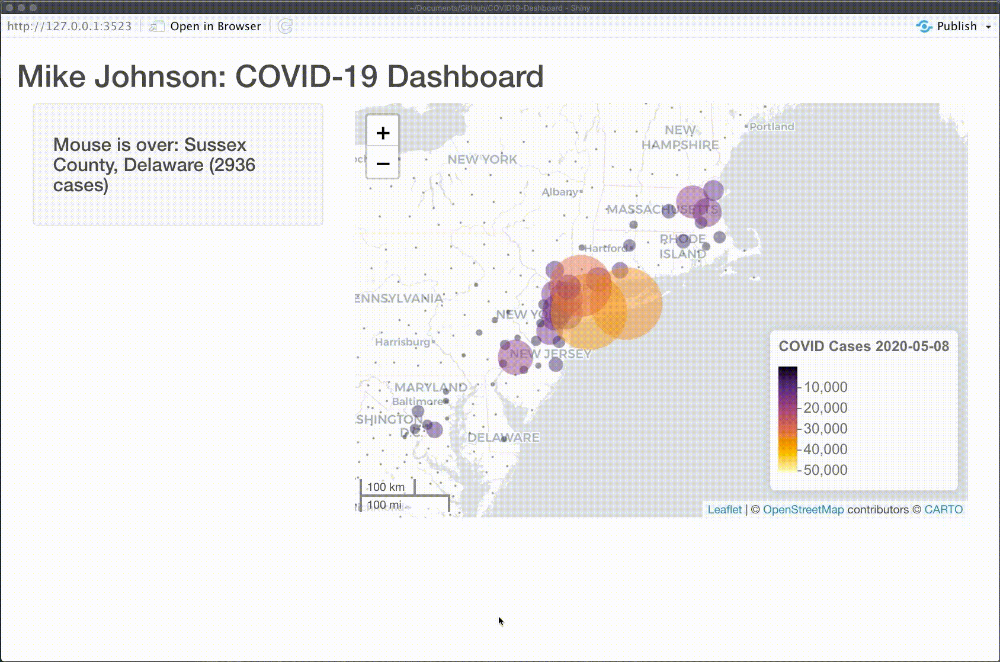

```{r klippy, echo=FALSE, include=TRUE}
klippy::klippy(position = c('top', 'right'))
```

```{r setup, include=FALSE}
knitr::opts_chunk$set(echo = TRUE, 
                      class.source = "numberLines lineAnchors",
                      warning = FALSE, message = FALSE,
                      eval = FALSE)
```


In the last [section](05_shiny_basics.html) we set up the basic skeleton of a Shiny Application. In this section we will demonstrate how to add your leaflet `basemap` to the Shiny `ui` and how `observeEvent` can be used to record how the mouse cursor interacts with the `leaflet` map.

## Extending the UI

Here is the UI object we ended with in the last section with a few modifications. 

```{r}
ui <- fluidPage(

  titlePanel('Mike Johnson: COVID-19 Tracker'),
  
  # Sidebar layout output definitions ----
  sidebarPanel(
    # Output: Message ----
    textOutput("covidMessage", container = h4)
  ),

  # Main panel for displaying outputs ----
  mainPanel(
    # Output: Map ----
    leafletOutput('covidMap')
  )
)
```

Notably, we've added a `sidebarPanel` and `mainPanel` to the `fluidPage` to define how space on the page is distributed.

In the `sidebarPanel` we are going to display `textOutput`. We call the object it will display `covidMessage`. The container parameter generates an HTML element to hold the text defined by the 'h4' HTML tag (think of this as the size of the text). 

It is important here to recognize that `covidMessage` is a variable containing text stored in the output list, and **not** a text string itself. We will define  `covidMessage`  in the server function. The UI then is only reacting the the `covidMessage` variable in the server function.

In the `mainPanel`, we are going to display a leaflet object (also from the output list) called `covidMap`. Here again, the UI only displays the `covidMap` object. All rendering, and modification of `covidMap` **MUST** occur in the server function.

## Extending the server function

Last time we set up our server function with parameters called `input` and `output`. In a general sense:

 * **input** is a list of things defined in the `UI` and passed to the `server`
 * **output** is a list of things generated in the `server` that are passed to the `UI.`

Keeping your `input` and `output` lists aligned is what allows `Shiny` to generate reactive web applications.

Lets set up our server function to specify what `covidMessage` and `covidMap` actually store. We will save these to the `output` list so that the UI can make use of them! First, we must define an initial `reativeValue` to store the `covidMessage.` In the scope of the reactiveValues list we call this object `msg`, and store all reactiveValues (in this case just `msg`) as object `v`.

Next, we create the `covidMap` by rendering our basemap as a leaflet object and saving it directly to the output list as `covidMap`.

Last, we render our reactive `msg` variable as Text and save it to the `covid_message` slot of the output list.

Remember, only the render map and text object can be shown in the UI!

```{r}

server <- function(input, output) {
  # Global variables initialized ----
  v   <- reactiveValues(msg = "First Shiny!!!")
  # Leaflet Map ----
  # ---- must be rendered as leaflet ----
  output$covidmap     <- renderLeaflet({ basemap })
  # Message to Display ----
  # ---- must be rendered as text ----
  output$covid_message <- renderText(v$msg)
}

```

## Run the App:


Great! We see our leaflet basemap is rendered, as is our default message "First Shiny!!!". Now lets see if we can use the reactive capabilities of Shiny to modify the `covidMessage` based on where the mouse cursor is on the `covidMap.`

## Engaging a Mouse Observer (Mouseover and Mouseout)

This will be our fist detailed exploration of how Shiny can engage with user actions. Here we want to `observe` what the mouse is doing in the UI and pass information from the cursor to server function through the `input` list. 

In the server function, lets start by observing an event (`observeEvent`). The event we want to observe is the mouse cursors interaction with the map object.

Now the mouse can do a lot of things with respect to a leaflet map, it can *mouseover*, *mouseout*,  and *mouseclick*. When these actions occur with map markers, they are able to store the id of the marker. Remember that the marker ID was defined as the FIPS code in our `basemap` function (layerID = ~fips). That was why that variable was so critical! Therefore, the interaction between the map and mouse is expressed as the FIP code of the map marker.

Generally our goal is that every time the mouse cursor passes *over* a *marker*, it will change the `covidMessage` to something specific to that marker.

To do this, in our `observeEvent` we will listen to the `input` list.  The object we want to observe is the `covidMap`, and more specifically, the `covidMap_marker`. In terms of the action we want to listen for, we observe as the mouse moves over (mouseover) a marker.

```{r}
# Add this to the server function
observeEvent(input$covidMap_marker_mouseover, {
  ...
}
```

So in this observer we are observing the `covidMap_marker_mouseover`, and at anytime, we can extract the id of the marker from the `covidMap_marker_mouseover`. Remember that the marker ID was defined as the FIPS code in our basemap function. We use this id/FIP code to subset the 'today' dataset and extract the name attribute we added. We then use the subset data to refine the reactive message in the `v$msg` that will be rendered and passed to the UI. Let's see this in action!

```{r}
observeEvent(input$covidMap_marker_mouseover, {
    txt = filter(today, fips == input$covidmap_marker_mouseover$id) 
    v$msg <- paste0("Mouse is over: ", txt$name, " (", txt$cases, " cases)")
  })
```

But what happens when the mouse leaves the marker? Do we want the message to stay? Certainly not! So, lets add another listener that observes the mount moving OUT (mouseout), of a MARKER, on a MAP object shown in the UI. When this happens we change the reactive map message which is then shown in the UI
  
```{r}
observeEvent(input$covidmap_marker_mouseout, {
  v$msg <- "Mouse is over: "
})
```

With those two new observers in you server function, lets once again run our Shiny App:



A full `app.R` file up to this point can be found [here](https://github.com/mikejohnson51/COVID-19-dashboard/blob/master/scripts/example_06.R)

## Conclusion

With that, you are ready to add more elements to your Shiny App. In the next [section](07_shiny_graphs.html) we'll see add our `dyGraph` to our interface and syncing it with the `leaflet` map.