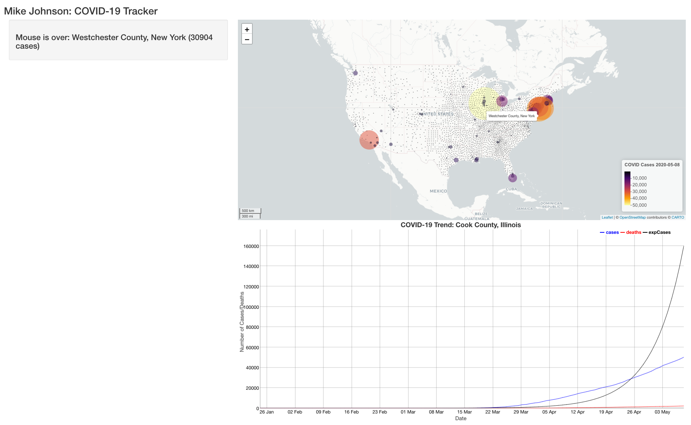

```{r klippy, echo=FALSE, include=TRUE}
klippy::klippy(position = c('top', 'right'))
```

```{r setup, include=FALSE}
knitr::opts_chunk$set(echo = TRUE, 
                      class.source = "numberLines lineAnchors",
                      warning = FALSE, message = FALSE,
                      eval = FALSE)
```

In the last [section](06_shiny_maps.html) we saw how the mouseover listener can be used to extract the marker id -- in this case the FIPS code. Being able to extract this id from a leaflet map and mouse action is ideal for using the functions (make_graph, and make_table) we developed in section 02.

Lets start with adding the `dyGraph`. Remember that to add an object we need to define it both in the UI (where it will be seen) and in the server (how it will be rendered, and adjusted)

In the UI we want to display the chart below the covid_map in the mainPanel. We know we are generating a dyGraph object so we add `dyGraphOutput` and expect to display a renders output object called `covid_chart.`

## Extending the UI

Below is our UI interface with some slight modifications:

```{r}
ui <- fluidPage(
  titlePanel('Mike Johnson: COVID-19 Tracker'),
  # Sidebar layout output definitions ----
  sidebarPanel(
    textOutput("covid_message", container = h3),
  ),
  
  # Main panel for displaying outputs ----
  mainPanel(
    # Output: Map ----
    leafletOutput('covidmap'),
    # Output: Chart ----
    dygraphOutput('covid_graph')
  )
)
```

Here you'll notice that we added a `dyGraphOutput` that expects to find a `covid_graph` object in the the output list. This means the server must return a `dyGraph` object in the `covid_graph` slot of the `output` list.

By placing this line of code underneath the `leafletOutput` we ensure the `UI` will render the graph underneath the map. We also made a visual tweak by telling the UI to render both the `covidMap` and `covidGraph` objects with a height of 600 pixels.

## Extending the server

W=In our server function we will want to generate a dyGraph using our `make_graph` function. Remember that  `make_graph` requires a FIP code as input. 

In general this FIP will be informed by user input. However when the application first starts we need a default value so the chart will execute. 

It might also be clear to you at this point that all of our functions require a FIP code as input. Because of this, we will create a global FIP variable that persists through the global scope of the server function. As a default, lets make a global FIP value containing the county with the most cases and add a line to save dyGraph, made with our make_graph function, to the output list.

```{r}
server <- function(input, output, session) {
  # Global variables initialized ----
  FIP <- today$fips[which.max(today$cases)]
  v   <- reactiveValues(msg = "First Shiny!!!")
  
  # Leaflet Map ----
  # ---- must be rendered as leaflet ----
  output$covid_map  <- renderLeaflet({ basemap })
  
  # dyGraph Chart ----
  # ---- must be rendered as dyGraph ----
  output$covid_chart <- renderDygraph({ make_chart(covid19, FIP) })
  
  # Events ----
    # removed here for clarity keep them in your server function
  
  # Message to Display ----
    # removed here for clarity keep them in your server function
}
```

When we run our complete shiny application we'll see something like this:


Great!! `r emo::ji("smile")` we have a `map` that listens to `mouseover` and `moustout` listeners and a `chart` that displays the COVID trends for the USA county with the most cases.

While setting a default FIP value is needed for the application to initialize, it would be better if the chart adapted to input from the map -- much like our reactive message! 

But, changing the graph with the `mouseover` would be impractical (think how fast it would adapt!!). Instead, lets change the chart when a map marker is clicked.

## Engaging a Mouse Observer (Mouseclick)

This requires observing the event of a mouse click. Following on our pattern from before, a `covidmap_marker_mouseclick` will do the trick!

Lets look at what to add to the server function:

```{r}
observeEvent(input$covidMap_marker_click, {
    FIP <<- input$covidMap_marker_click$id
    output$covid_graph <- renderDygraph({ make_graph(covid_data, FIP) })
})
```

IMPORTANT: There is one **very** important thing to note in this entry. Here, the `<<-` sets the global value of FIP to the id/FIP of the clicked on marker. Had we just used `<-`, the assignment to FIP would have only occurred in the scope of this `observeEvent` function. By using the  `<<-` assignment operator, we are setting the value of FIP is the global scope of the program, and not just the function. Ultimately this will make the identified FIP accessible to other listeners in the application.

## Extending our map functionality

Wouldn't it also be nice if we could modify the map based on our click? How about we call on our `zoom_to_county` function by adding a map modifier to the mouseclick listener:

```{r}
observeEvent(input$covid_map_marker_click, {
    FIP <<- input$covid_map_marker_click$id
    output$covid_graph <- renderDygraph({ make_gprah(covid_data, FIP) })
    leafletProxy('covid_map') %>% zoom_to_county(counties, FIP)
})
```

Doing this highlights another **very** important distinction shiny/leaflet functionality. 

Notice that with the `dyGraph` option we simply re-rendered the plot and overrode the existing `output$covid_grapht`  object. This is because once a new FIP was selected, there was nothing from the previous graph that is be useful.

The same isn't true for leaflet maps, in fact, our changes are often related to zooming, adding, or removing features to an existing rendered map. 
Therefore there is no need to re-render the map!

The Shiny and leaflet developers recognize this and offer the `leafletProxy` function to create a map-like object that can be customize and control a map that has already been rendered. Therefore instead of passing the direct basemap object to zoom_to_county, we pass a proxy of that object and Shiny knows to modify the existing rendered map.

With all those changes lets run our app once again!


Now when a marker is clicked, the map zooms to the county, displays the border, and changes the chart – all based on user input!!

## Conclusion

With that, you are ready to extend your shiny app even more. In the next [section](08_shiny_tables.html) we'll see add our `DT` table to our `sidePanel` and syncing it with our map and chart.