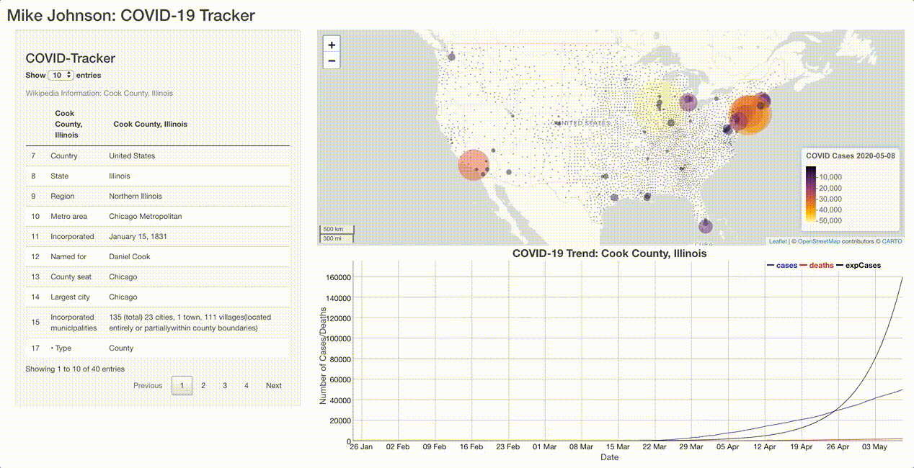

```{r klippy, echo=FALSE, include=TRUE}
klippy::klippy(position = c('top', 'right'))
```

```{r setup, include=FALSE}
knitr::opts_chunk$set(echo = TRUE, 
                      class.source = "numberLines lineAnchors",
                      warning = FALSE, message = FALSE,
                      eval = FALSE)
```

So we've set up a `map` ( [section](06_shiny_maps.html) ) and `dygraph`( [section](07_shiny_graphs.html) ) that are synchronized using Shiny reactive components and a common FIP id. Now lets use the same principles to add the table we generate with `make_table`. 

## Extending the UI

Below is our UI interface with some slight modifications:

```{r}
ui <- fluidPage(
  
  titlePanel('Mike Johnson: COVID-19 Tracker'),
  # Sidebar layout output definitions ----
  sidebarPanel(
    # Output: Message ----
    textOutput("covidMessage", container = h3),
    # Output: Table ----
    DTOutput("covidTable")
  ),
  
  # Main panel for displaying outputs ----
  mainPanel(
    # Output: Map ----
    leafletOutput('covidMap'),
    # Output: Chart ----
    dygraphOutput('covidGraph')
  )
)
```

At this point our `mainPanel` is getting pretty full so we added our table to the `sidebarPanel`instead (Don't forget commas to separate UI elements `r emo::ji("smile")`). 

## Extending the server

Now, lets make sure our server function appropriately renders the `covidTable` using our `make_table` function. Remember we need the table to populate before any interaction happens (using the county with the most cases), and then update itself on each mouse click in the map.

```{r}
server <- function(input, output, session) {
  
  # Global variables initialized ----
    # removed here for clarity keep them in your server function
  # Leaflet Map ----
    # removed here for clarity keep them in your server function
  # dyGraph Chart ----
    # removed here for clarity keep them in your server function

  # DT Table ----
  # ---- must be rendered as DT ----
    output$covidTable   <- renderDT({ make_table(today, FIP) })
  
  # Events ----
     # reduced here for clarity keep them in your server function
  
   observeEvent(input$covidMap_marker_click, {
      FIP <<- input$covidMap_marker_click$id
      output$covidGraph <- renderDygraph({ make_graph(covid19, FIP) })
      leafletProxy('covidMap') %>% zoom_to_county(counties, FIP)
      output$covidTable   <- renderDT({ make_table(today, FIP) })
    })

  # Message to Display ----
    # removed here for clarity keep them in your server function
}
```



A full `app.R` file up to this point can be found [here](https://github.com/mikejohnson51/COVID-19-dashboard/blob/master/scripts/example_08.R)

## Conclusion

Alright! That's it, you've built a complete, interactive, Shiny application that incorporates web scraping, dynamic charts, maps, and tables! 

The next [section](09_autocomplete_window.html) will go over one one last advanced topic about implementing an auto filling search bar and connecting it to a keyboard listener (enter key). If you aren't in the mood for those, skip to [section 10](10_publish.html) to see how change the theme of your application and  deploy it as a live website!


