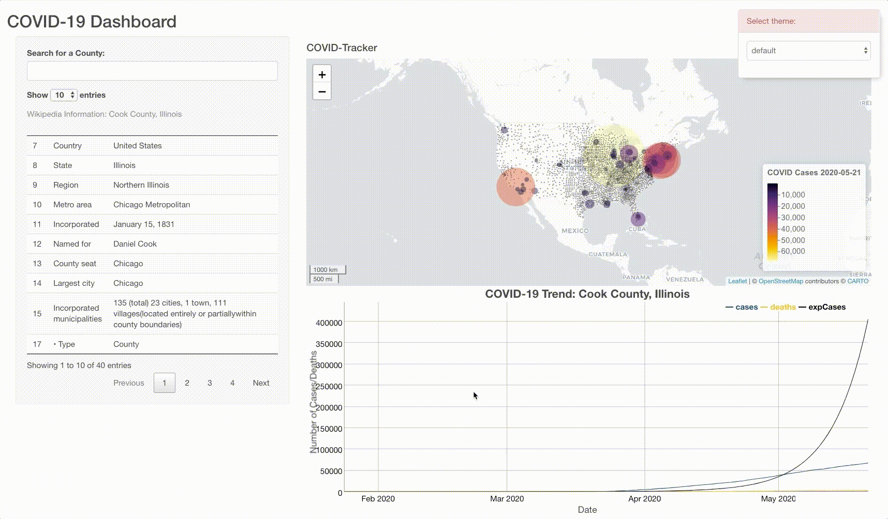
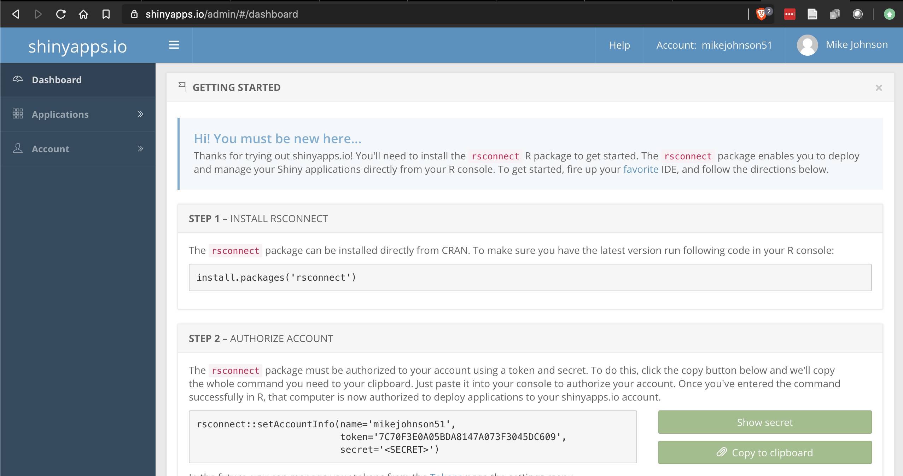
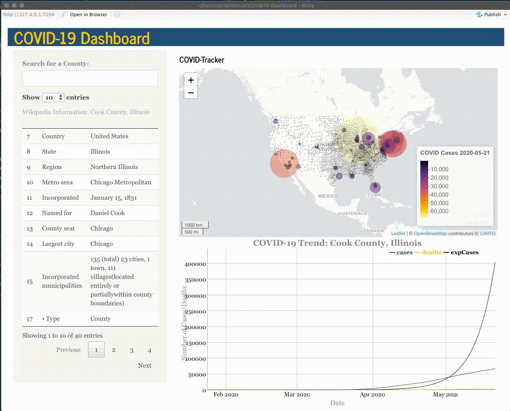

```{r klippy, echo=FALSE, include=TRUE}
klippy::klippy(position = c('top', 'right'))
```

```{r setup, include=FALSE}
knitr::opts_chunk$set(echo = TRUE, 
                      class.source = "numberLines lineAnchors",
                      warning = FALSE, message = FALSE,
                      eval = FALSE)
```

Our complete Shiny App was finished in the last sections ( [basic](08_shiny_tables.html); [advanced](09_autocomplete_window.html)). In this section we will modify the theme of the application and publish it to a free web server!

## Changing the theme

By default, we are using the base Shiny theme but we want to personalize the appearance of our application. HTML and JavaScript can be used to endlessly refine the Shiny UI, however, we are only going to utilize a pre-canned theme accessible in the `shinythemes` [package](https://rstudio.github.io/shinythemes/). 

## Live theme selector

To experiment with the possible themes we can inject the `shinytheme::themeSelector()` into our UI and launch our application again.

```{r}
ui <- fluidPage(
 shinythemes::themeSelector(), # <--- ADD THIS ANYWHERE IN YOUR UI!
 titlePanel('Mike Johnson: COVID-19 Tracker'),
  # Sidebar layout output definitions ----
  sidebarPanel(
    autocomplete_input("auto", 
                       "Search for a County:", 
                       value = "",
                       max_options = 5,
                       structure(today$fips, names = today$name)),
    # Output: Message ----
    DTOutput("covidTable"),
  ),
  
  # Main panel for displaying outputs ----
  mainPanel(
    textOutput("covidMessage", container = h4),
    # Output: Map ----
    leafletOutput('covidMap'),
    # Output: Chart ----
    dygraphOutput('covidGraph')
  )
)
```




Once you identify a theme you like from the drop down menu, substitute the live `themeSelector` with `theme = shinytheme(...)`, and provide the name of the theme you selected. Here, I chose "*journal*".

```{r}
ui <- fluidPage(

  theme =  shinytheme("journal"),
  titlePanel('Mike Johnson: COVID-19 Tracker'),
  # Sidebar layout output definitions ----
  sidebarPanel(
    autocomplete_input("auto", 
                       "Search for a County:", 
                       value = "",
                       max_options = 5,
                       structure(today$fips, names = today$name)),
    # Output: Message ----
    DTOutput("covidTable"),
  ),
  
  # Main panel for displaying outputs ----
  mainPanel(
    textOutput("covidMessage", container = h4),
    # Output: Map ----
    leafletOutput('covidMap'),
    # Output: Chart ----
    dygraphOutput('covidGraph')
  )
)
```

That's it! Now you are done `r emo::ji("smile")`! 

A full `app.R` file can be found [here](https://github.com/mikejohnson51/COVID-19-dashboard/blob/master/scripts/app.R). Feel free to use this file, but make sure you personal the code in the appropriate places.

## Deploying your application

Now that your code is all finished, you application has a unique theme, and you are happy with it, lets publish it as a website you can share with others.

To do this we will using [shinyapps.io](https://www.shinyapps.io/). This service offers a free tier that makes deploying your Shiny applications super simple. You don’t need to own a server or know how to configure a firewall meaning no hardware, installation, or annual contract is required. To get going,  navigate to that [website](https://www.shinyapps.io/) and sign-up.

Once you are signed up, you will be directed to a dashboard that looks like something like this:



Once you are signed up, return to you R session and launch your application. 

Next, click the `Publish` button in the upper right hand corner. 

If you have not yet connected your R session to shinyapps.io then you need to add your account following the directions and using the information found on the home page of your shinyapp.io account. 

Once your account is connected, make sure the data folder, `helper.R`, and `app.R` files are selected, and that you like the Title of your application.

After that, hit publish and let the magic happen!

Here there are two warnings to be wary off.

1. Uploading an app can take a few minutes - especially the first time.
2. Remember `shinyapps.io` is a free service. On occasion it will error out on deployment. Before contacting the TA or worrying to much simply try re-publishing it to see if the same error occurs. 

See below for an visual example of the process.



If/when you make changes to your application, follow this same process to simply republish the application and the live instance online will be detached and reloaded!

## Conclusion

Congratulations! You have built a fully felged, customized web application displaying up-to-date, live COVID information in map, table, and graph form!

Be proud, this is a lot of information and I hope you learned a bit about what the world of data-driven GIS and online visualization can offer.

