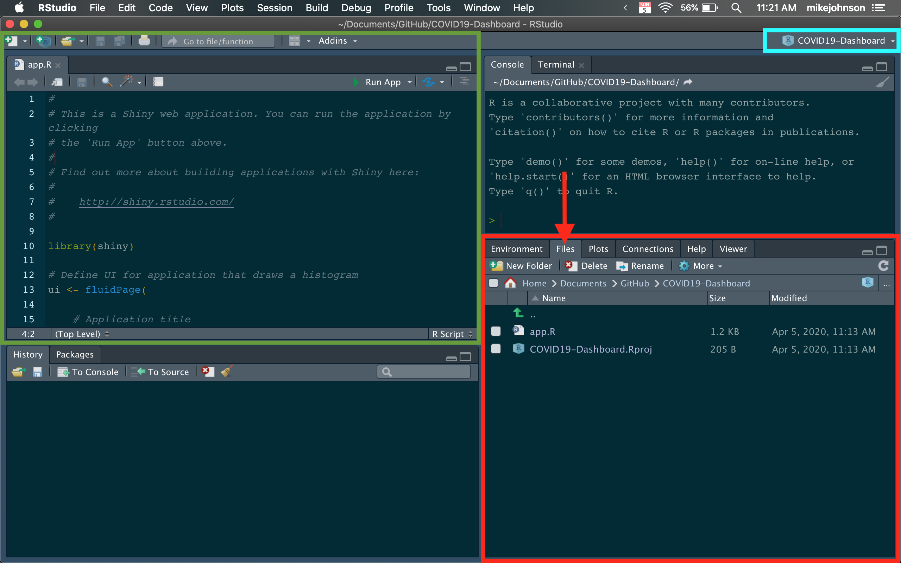

```{r klippy, echo=FALSE, include=TRUE}
klippy::klippy(position = c('top', 'right'))
```

```{r setup, include=FALSE}
knitr::opts_chunk$set(echo = TRUE, 
                      class.source = "numberLines lineAnchors",
                      warning = FALSE, message = FALSE,
                      eval = TRUE)
```

```{r, out.width = "300px", eval=TRUE,echo=FALSE, fig.align='center'}
knitr::include_graphics("figures/logos.png")
```

## Getting Set up

To create our COVID19-Dashboard we need to create new R project. R projects are useful for ensuring that paths and directories are centralized. To make a new project launch RStudio on your computer. 

If you do not have R and R studio already installed you can find R [here](https://www.r-project.org/). Make sure to get the most up to data version that is not a "pre-release".

R Studio is an IDE ("Integrated Development Environment") for managing R projects, writing code, and running examples. You can download RStudio [here](https://rstudio.com/products/rstudio/#Desktop). 

Make sure to get the free Desktop version about halfway down the page.

Follow the directions for installing each of those and you a will be set to go!

## Launch R Studio

With R and RStudio installed, launch RStudio. Here we will be creating a new project by selecting:

`File -> New Project -> New Directory -> Shiny Web Application`

When prompted, fill in the project name "e.g. COVID19-Dashboard" and tell RStudio where to put your project on your computer (think of your project as a big folder where everything will be stored and linked). You should have something like this:

```{r, out.width = "400px", eval=TRUE,echo=FALSE}

```

When finished hit, **Create Project!**

After a moment a new session window will open that looks like the following, although your tabs may be in different sections...

```{r, out.width = "600px", eval=TRUE,echo=FALSE}

```

Notice that your session is linked to your project (blue box). 

In the lower right hand corner of the session (red box), you have a the *Environment* tab that shows all the active objects in your session. The *files* tab shows all the files and folders in your default (project) workspace as in a PC/Mac finder/explorer window.  The *plots* tab will show all your graphs. 

In the green window you will write code and open new/existing scripts.

Finally, all output will be printed to your console (upper right, not colored)

All of this will quickly become clear once we get going `r emo::ji("smile")`

Go ahead and close the RStudio session. 

### 1. Restarting Your R-project

Someday you will want to revisit your project. Lets see how to do this, and the advantage to using R projects.

Navigate to the project folder (look at the location you provided in the project creation).

Open the `*.Rproj` file.

You'll see you've opened the same session! 

### 2. Create a new data folder

In the files tab (remember in the red box) you'll see the icon for 'New Folder'. Click that, and name your new folder `data`. This is a common convention for structuring R projects.

You should see the new folder appear in you project directory.

### 3. Create a R scripts

New R scripts can be created by selecting:

`File -> New File -> R Script`

Or hitting `CMND+SHIFT+N` or `CTR+SHIFT+N`

Once a new `Untitled.R` file is opened, you should save it to the desired location. In our case your top-level project directory (see below):

```{r, out.width = "400px", eval=TRUE,echo=FALSE}

```


### 4. Getting the needed libraries

R comes loaded with many base packages. However none of these help us build interactive web applications using spatial data. Because of this, we will need to install a number of packages.

In R, packages can be installed from CRAN (Comprehensive R Archive Network) using the following pattern:

```{r, eval = FALSE}
install.packages('dplyr')
```

Where, 'dplyr' is the name of the package we want to install. So what exactly is a package?

Think of a package as a set of functions that others have written to make your life easier. 

**IMPORTANT:**  installing a package only downloads the source code onto your computer. To actually use it, you'll need to attach/load the package using the `library()` call.

```{r}
library(dplyr)
```

Open your `helpers.R` file from the files tab and copy the following into the top of the file. This will ensure that you download and 

```{r}
# 1. Install missing packages ----
list.of.packages <- c("dplyr", "sf", "leaflet", "dygraphs", "DT", 'shiny')

new.packages <- list.of.packages[!(list.of.packages %in% installed.packages()[,"Package"])]
if(length(new.packages)) install.packages(new.packages)

# 2. Load packages ----
# Data Manipulation
library(dplyr)    # data.frames
library(sf)       # Spatial

# Interactive Data Viz
library(leaflet)  # Maps
library(dygraphs) # Charts
library(DT)       # tables

# Shiny
library(shiny)    # Starting Reactivity
```

Run all the code by highlighting and hitting CMND+ENTER (Mac) or CTRL+ENTER (Windows).

Alternatively you can run a line one-by-one using the same keyboard shortcuts, or the `RUN` icon in the top right of the text editing window.

The first time you run this code it will take a while since everything needs to download. Fortunately this only needs to be done once.

Along the way you will be asked to answer a few questions:

Do you want to restart RStudio after?

**Yes**

Do you want to install from source the package which needs compilation? (Yes/no/cancel)?

This has to do with the sf package. For now, go ahead and type no to avoid potential build issues.

**no**

### 4. Conclusion

Now that you have your project set up, and all the needed libraries installed, we are ready to start building out our application!

The first thing we'll need is data. Let's move to [section 2](01_getting_data.html) to learn how.

