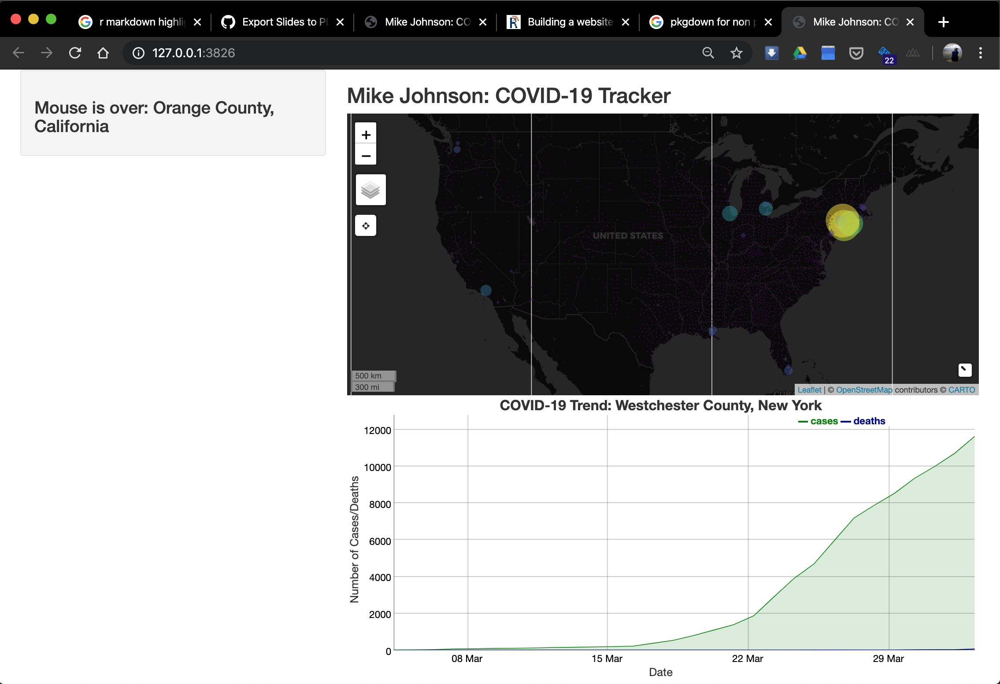
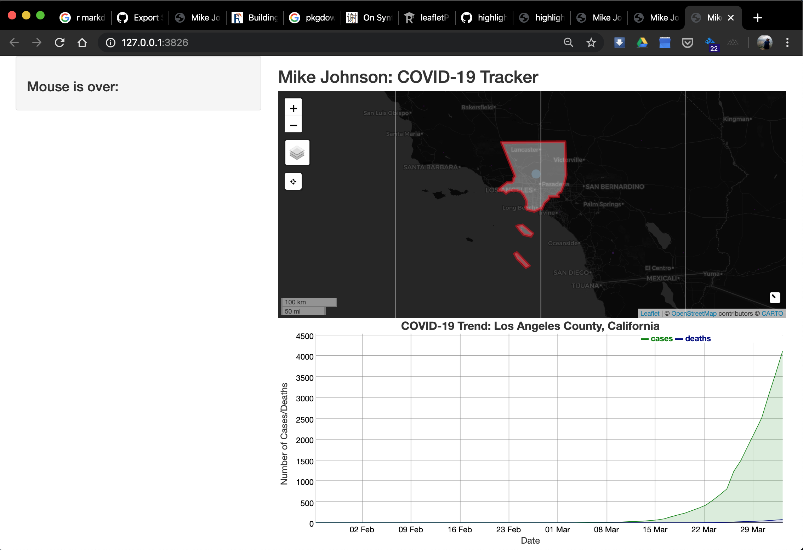

```{r setup, include=FALSE}
knitr::opts_chunk$set(echo = TRUE, eval = FALSE)
```

## Adding our Chart

In the last section we saw how the mouseover listener can be used to extract the marker id -- in this case the FIPS code. Being able to extract this id from user input is ideal from using the function (make_graph, and make_DT) we developed in section 02.

Lets start with adding the dyGraph Chart. Rember that to add an object we need to define in in the UI (where is will be seen) and it the server, how it will be rendered, and adjusted.

In the UI we want to display the chart below the covid_map in the mainPanel. We know we are generating a dyGraph object so we add dyGraphOutput and expect to display a renders output object called 'covid_chart'.

Go ahead and add this line to your UI object.

```{r}
ui <- fluidPage(
  # Sidebar layout output definitions ----
  sidebarPanel(
    # Output: Message ----
    textOutput("covid_message", container = h3) #<<
  ),
  
  # Main panel for displaying outputs ----
  mainPanel(
    # App title ----
    titlePanel('Mike Johnson: COVID-19 Tracker'),
    # Output: Map ----
    leafletOutput('covid_map'),
    # Output: Chart ----
    dygraphOutput('covid_chart')
  )
)
```

Great! Now lets define how that object is created in the server function. To do this we will use our make_graph function. Remember that this function requires an input FIP code. So we first must define a global variable called FIP.

As a default, lets display a chart for the county with the most cases. In our global variables lets define this.

With the global FIP variable defined, we can generate a dyGraph chart using our function and rendering it as a new output dyGraph object called covid_chart.

```{r}
server <- function(input, output, session) {
  # Global variables initialized ----
  FIP <- today$fips[which.max(today$cases)]
  v   <- reactiveValues(msg = " First Shiny!!! ")
  # Leaflet Map ----
  # ---- must be rendered as leaflet ----
  output$covid_map     <- renderLeaflet({ leaf_map })
  
  # dyGraph Chart ----
  # ---- must be rendered as dyGraph ----
  output$covid_chart   <- renderDygraph({ make_chart(covid19_data, FIP) })
  
  # Events ----
  # ---- mouse ----
  observeEvent(input$covid_map_marker_mouseover, {
    txt = filter(today,fips == input$covid_map_marker_mouseover$id) 
    v$msg <- paste("Mouse is over: ", txt$call)
  })

  observeEvent(input$covid_map_marker_mouseout, { v$msg <- "Mouse is over: " })
  
  # Message to Display ----
  # ---- must be rendered as text ----
  output$covid_message <- renderText(v$msg)
}
```


```{r, eval = FALSE}
runApp(shinyApp(ui, server), launch.browser = TRUE)
```



## Adding a Mouse Click 

Now while setting a default FIP value is needed for the application to initialize, it would be better if the chart adapted to input from the map -- much like our message!

But, changing the graph with the mouseover would be impractical, so instead, lets base the change on if a map marker is clicked. This requires observing the event of a mouse click. Following on our pattern from before, a covid_map_marker_mouseclick will do the trick!

Lets look at what to add to the server function:

```{r}
observeEvent(input$covid_map_marker_click, {
    FIP <<- input$covid_map_marker_click$id
    output$covid_chart <- renderDygraph({ make_graph(covid_data, FIP) })
})
```

There is one **very** important thing to note in this entry. Here, the '<<-' sets the global value of FIP to the id/FIP of the clicked on marker. Had we just used '<-', the assignement to FIP would have only occured in the scope of this observeEvent() function. However, by choosing the '<<-' assignment operator, we are setting the value of FIP is the scope of the program, and not just the function.

Wouldn't it also be nice if we could also modify the map based on our click? How about we add our 'zoom_to_county' capabilites here?

```{r}
observeEvent(input$covid_map_marker_click, {
    FIP <<- input$covid_map_marker_click$id
    output$covid_chart <- renderDygraph({ make_chart(covid_data, FIP) })
    leafletProxy('covid_map') %>% zoom_to_county(counties, FIP)
})
```

Here, there is another **very** important distinction to look at. Notice that with the dyGraph option we re-render the plot and override the current output dygraph object. This is because once a new FIP was selected, there was nothing from the previously rendered graph that would be useful to us.

The same isn't true for leaflet maps, in fact, our changes are often related to zooming, adding, or removing features to an existing rendered map. Therefore there is no need to re-render the map!

The Shiny and leaflet developers recognize this and offer the leafletProxy() function to create a map-like object that can be used to customize and control a map that has already been rendered.

With all those changes lets run our app once again!

```{r, eval = FALSE}
runApp(shinyApp(ui, server), launch.browser = TRUE)
```

Now when a marker is clicked, the map zooms to the county, displays the border, and changes the chart -- all based on user input!! 



