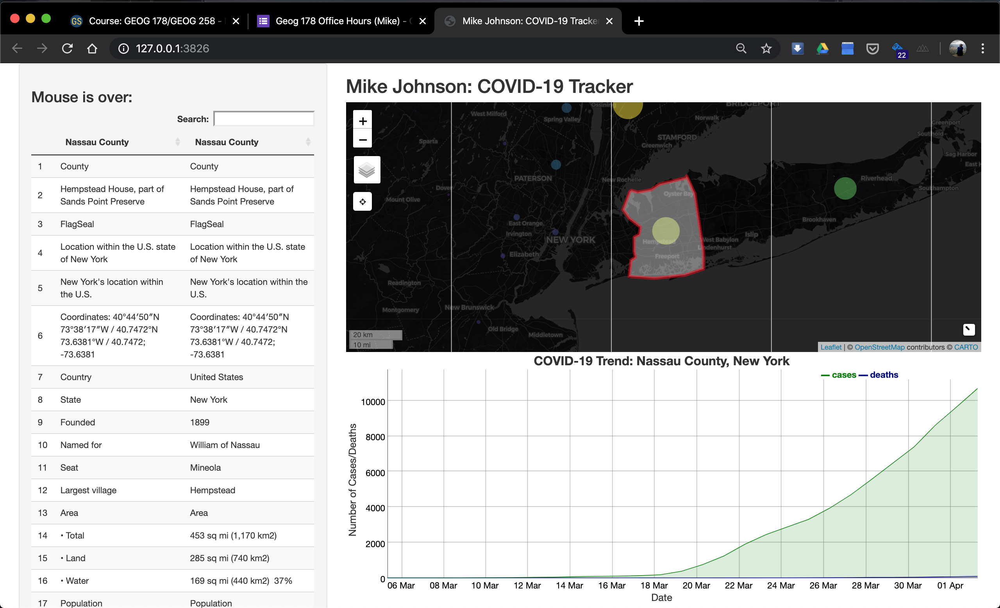

```{r setup, include=FALSE}
knitr::opts_chunk$set(echo = TRUE, eval = F)
```

So we've set up a interactive map and dyGraph that are connected to each other using Shiny reactive components through the common FIP id. Now lets use the same principles to add the table we scrape from Wikipedia. At this point our mainPanel is getting pretty full so instead we will add our table in the sidebarPanel underneath the mouseover message. (Don't forget commas to seperate UI elements :))

Here we expect to show a rendered DT output object and expect it to be named "covid_table".

```{r}

ui <- fluidPage(
  # Sidebar layout output definitions ----
  sidebarPanel(
    # Output: Message ----
    textOutput("covid_message", container = h3),
    DTOutput("covid_table")
  ),
  
  # Main panel for displaying outputs ----
  mainPanel(
    # App title ----
    titlePanel('Mike Johnson: COVID-19 Tracker'),
    # Output: Map ----
    leafletOutput('covid_map'),
    # Output: Chart ----
    dygraphOutput('covid_chart')
  )
)
```

Now to add the same information to the server fucntion. Remeber we need the table to populate before any interaction happens (using the county with the most cases), and then update itself on each mouse click.

```{r}

server <- function(input, output, session) {
  
  # Global variables initialized ----
  FIP <- today$fips[which.max(today$cases)]
  v   <- reactiveValues(msg = " First Shiny!!! ")

  ...
  
  # DT Table ----
  # ---- must be rendered as DT ----
  output$covid_table   <- renderDT({ make_DT(today, FIP) })
  
  # Events ----

  ...
  
  observeEvent(input$covid_map_marker_click, {
    FIP <<- input$covid_map_marker_click$id
    output$covid_chart <- renderDygraph({ make_chart(covid19_data, FIP) })
    leafletProxy('covid_map') %>% zoom_to_county(counties, FIP)
    output$covid_table   <- renderDT({ make_DT(today, FIP) })
  })
  
  ...
  
}
```


Alright! Thats it, you've built a complete interactive Shiny application that incorporates webscraping, dynamic charts, maps, and tables! The next two lessons will go over some more advanced topics like javascript formating, builing an autocomplete table and linking it to a keyboard listener. 

If you aren't in the mood for those, skip to section 9 to see the full Shiny application script in one place, and section 10 to see how to deploy you application to a live website!


