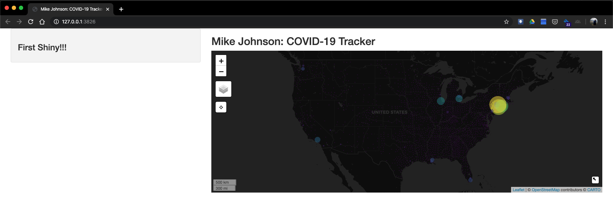
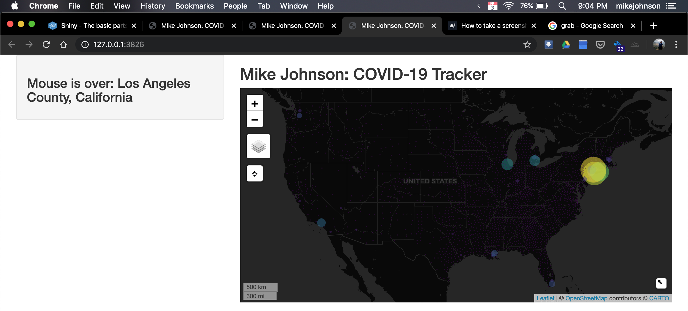

```{r setup, include=FALSE}
knitr::opts_chunk$set(echo = TRUE, eval = FALSE)
```

```{r, eval  = F, echo = F}

# Data Manipulation
library(dplyr) # data.frames
library(sf)    # Spatial

# Interactive Data Viz
library(leaflet)  # Maps
library(dygraphs) # Charts
library(DT)       # tables

# Shiny
library(shiny)  

counties <- readRDS("data/counties.rds")

# Source helper functions -----
source("helpers.R")

# Initalize data
covid19_data = read_covid19()
today = today_centroids(countiesm covid19_data)
leaf_map = base_leaf(today)
```

## Starting the UI

We save all of this code, the ui object, the server function, and the  call to the shinyApp() function, in an R script called app.R. This is the same basic structure for all Shiny applications.


Here we are creatining a fluid page.


Here is the user interface object for our COVID-19-dashboard application. Notice that within the fluidPage we've added a sidebarPanel and mainPanel function to define how space on the page is distributed.

In the sidebarPanel we are going to display textOutput. We call the object it will display "covid_message". Here the container fuction generates an HTML element to contain the text. Here the size of this text is defined by the 'h3' tag.

In the mainPanel, we are going to render a leaflet map. Here it will display the obput object called "covid_map" that must be rendered in the server function. We also define a appliation title in the mainPanel that is stored in a titlePanel.

```{r}

ui <- fluidPage(

  # Sidebar layout output definitions ----
  sidebarPanel(
    # Output: Message ----
    textOutput("covid_message", container = h3)
  ),

  # Main panel for displaying outputs ----
  mainPanel(
    # App title ----
    titlePanel('Mike Johnson: COVID-19 Tracker'),
    # Output: Map ----
    leafletOutput('covid_map')
  )
)

```

## Initialize the server function

The UI object, only defines how to lay out objects that are passed from a server function or defined by HTML.

Lets set up our server function to define the "covid_message" and "covid_map" that the UI will display. Below we set the foundations for our server function.

First we must define a intiatl reativeValue to store the "covid_message". Next we create the covid_map as


```{r}

server <- function(input, output, session) {
  
  # Global variables initialized ----
  v   <- reactiveValues(msg = " First Shiny!!! ")
  # Leaflet Map ----
  # ---- must be rendered as leaflet ----
  output$covid_map     <- renderLeaflet({ leaf_map })
  # Message to Display ----
  # ---- must be rendered as text ----
  output$covid_message <- renderText(v$msg)
}

```

## Run the App:

```{r}
runApp(shinyApp(ui, server), launch.browser = TRUE)
```



## Engaging a Mouse Observer

Here we want to observe what the mouse is doing in the UI and pass information from the cursor back to the server function. Part of the reactivity of Shiny allows the server to "listen" or "observe" what the mouse is doing.

Lets start by observing an event - namely the mouse cursors interactions with the covid_map object. What we want to do is observe the  map marker underneath the mouse. To do this we observe an event (observeEvent) in the "input". The object we want to observer is the covid_map, and more specifically, the covid_map_marker. Fianlly, we can add on the mouseover call.

So in the observer we are observing the covid_map_marker_mouseover, at anytime we can extract the id of the marker from the covid_map_marker_mouseover. Remember that hte marker ID was defined as the FIPS code in our base_map() function (see layerID = ~fips). We use this id/FIPS code to subset the 'today' dataset and extract the prettified call we added:

We then change the reactive message in the v$msg to tell us the county/state pair the mouse is over, which will be rendered as text in the server function, and then passed to the UI to display.

```{r}

# Add this to the server function
observeEvent(input$covid_map_marker_mouseover, {
    # Filter the 'today' data to only records were the FIP == mouseover marker ID
    txt = filter(today, fips == input$covid_map_marker_mouseover$id)
    # Update the reative message variable
    v$msg <- paste("Mouse is over: ", txt$call)
  })
```

But what happens when the mouse leaves the marker? Do we want the message to stay? Certainly not! So, lets add anthor listener with the 

  # So what happen once our mouse moves away from a marker? Well, we listen for that by observing the event of
  # the MOUSE, moving OUT (mouseout), of a MARKER, on a MAP object shown in the UI.
  # When this happens we change the reactive map message which is then shown in the UI
  
```{r}
observeEvent(input$covid_map_marker_mouseout, { v$msg <- "Mouse is over: " })
```

With those two new observers in you server function, lets once again run our Shiny App by recalling:

```{r}
runApp(shinyApp(ui, server), launch.browser = TRUE)
```

